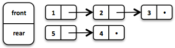

# Intro to Data Structures / Functional Data Structures in OO-Land

---

### Calibration (0)


Data structures?

---

### Calibration (1)


- Big-O and complexity?
- Interfaces vs. Implementation

---

### Calibration (2)

- Arrays?
- Linked Lists?
- Stacks and Queues?
- Hashing? Maps?
- Sets?

---

### Calibration (3)

- Immutability? Immutable data structures?
- Persistent data structures?
- Garbage collection?

---

### Preface

- Language agnostic, so I used `python`
- Trigger warning for folks with Mathematics / CS Theory background (why are you here anyway?)

---

## Primers

Data Structures, Complexity, Interfaces

---

### Data Structures

- Data lives in memory
- How we store that data in memory is important
- Computers are fast...but not that fast

---

### Big-O

$$f(x) = O(g(x))$$

if and only if

$$|f(x)| \leq M|g(x)|$$

for all $$x \geq x_0$$

---


---

### Complexity

$$O(1)$$

```python
x = 5
```

$$O(n)$$

```python
x = [1, 2, 3, 4, 5]
for i in x:
    print(i * 2)
```

$$O(n^2)$$

```python
x = [1, 2, 3, 4, 5]
for i in x:
    for j in x:
        print(i + j)
```

---

$$O(\log{n})$$

Binary search

$$O(n\log{n})$$

Most (practical) sorting algorithms

---

### Interfaces vs Implementations

- Interfaces: what a data structure does.
- Implementation: how a data structure does it

---

## Common Data Structures

---

### List Interface

- Support `add(item, i)`, `remove(i)`, `get(i)`, `set(item, i)`
- Could use an Array, but what happens when you (1) add items (2) run out of space in the Array?
- Array backed lists

```
[ ][ ][ ][ ][ ][ ][ ][ ][ ][ ]
[a][b][c][ ][ ][ ][ ][ ][ ][ ]
[a][b][c][d][ ][ ][ ][ ][ ][ ]
[e][a][b][c][d][ ][ ][ ][ ][ ]
```

---

#### Linked List

```python
class Node:
    def __init__(self, data, next):
        self.data = data
        self.next = next
```

---

```python
class LinkedList:
    def __init__(self):
        self.head = Node(None, None)
        self.size = 0

    def add(self, item, index):
        current = self.head
        for i in range(0, index):
            current = current.next
        node = Node(item, current.next)
        current.next = node
        self.size = self.size + 1
```

---

#### Doubly Linked List

```python
class Node:
    def __init__(self, data, prev, next):
        self.data = data
        self.prev = prev
        self.next = next
```

---

```python
class LinkedList:
    def __init__(self):
        self.head = Node(None, None, None)
        self.tail = Node(None, self.head, None)
        self.head = self.tail
        self.size = 0

    def add(self, item, index):
        current = self.head
        for i in range(0, index):
            current = current.next
        node = Node(item, current.prev, current)
        node.prev.next = node
        current.prev = node
        size += 1
```

---

### Stack and Queue Interfaces

- Stack: Last In First Out (LIFO)
    - Can be implemented using a Linked List
- Queues: First In First Out (FIFO)
    - Can be implemented using a Doubly Linked List

---

### Map Interface

- A dictionary! Supports `get(key)` and `set(key, value)`
- Sketch of an implementation of a hash map
- Hashing and keys

---

### Set Interface

- A dictionary (without values). Supports `contains(key)` and `add(key)`
- HashSet is a common implementation

---

## Fun Stuff

Functional Data Structures!

> You can have any data structure you want as long as it's imperative - Not Henry Ford

---

### Motivating 'Wat's

```java
public class Rectangle implements Comparable<Rectangle> {
    private int width, height;
    public Rectangle(int width, int height);

    public int getWidth();
    public int getHeight();
    public void setWidth(int width);
    public void setHeight(int height);

    public int hashCode();
    public boolean equals(Object o);
    public int compareTo(Rectangle r);
}
```

---

```java
Set<Rectangle> s = new HashSet<Rectangle>();
Rectangle r = new Rectangle(2, 3);
s.add(r);

r.setWidth(5);
s.size(); // 1
s.contains(r) // AHA false

// even more fun...
s.add(r); // s = [Rectangle(5, 3), Rectangle(5, 3)]
```

---

### Java's Solution

```java
Set<Rectangle> s = new HashSet<Rectangle>();
Rectangle r = new Rectangle(2, 3);
Set<Rectangle> sUnmodifiable = Collections.unmodifiableSet(r);
sUnmodifiable.add(new Rectangle(3, 4)); // throws
```

You could also always create new sets, do a deep-copy. Still icky.

---

### Functional Data Structures


---

### What's Good?

- Immutability (no assignments)
- Persistence

---

### How to Build a List

```java
final class Cons<T> implements List<T>{
    private final T head;
    private final List<T> tail;
    private final int length;

    public static List<T> of(int... items) {
        // factory method that supports e.g.
        // List<Integer> list1 = List.of(1, 2, 3);
    }
}
```


---

### How to Prepend a List

```java
@Override
default List<T> prepend(T element) {
    return new Cons<>(element, this);
}
```


---

### How to Fold a List

```java
@Override
default <U> U foldLeft(U zero, BiFunction<? super U, ? super T, ? extends U> f) {
    U xs = zero;
    for (T x : this) {
        xs = f.apply(xs, x);
    }
    return xs;
}
```

---

### How to Reverse a List

```java
@Override
default List<T> reverse() {
    return (length() <= 1)
        ? this
        : foldLeft(empty(), List::prepend);
}
```

---

### How to Fold (Right) a List

```java
@Override
default <U> U foldRight(U zero, BiFunction<? super U, ? super T, ? extends U> f) {
    return reverse().foldLeft(zero, f);
}
```

---

### How to Append to a List

```java
@Override
default List<T> append(T element) {
    return foldRight(Cons.of(element), (x, xs) -> xs.prepend(x));
}
```

---

### Complexity?

- `prepend`ing is cheap
- `foldLeft` (as with all `foldLeft`s) are linear
- `reverse` is expensive, linear
- `foldRight` is expensive (linear + linear = linear)
- `append` is expensive linear

How do we think about complexity in this case?

---

### Complexity?

```java
Cons cons = Cons.of(1);
cons.prepend(2);
cons.prepend(3);
...
cons.prepend(n);
cons.reverse();
```

---

### Complexity?

```java
Cons cons = Cons.of(1); // O(1)
cons.prepend(2); // O(1)
cons.prepend(3); // O(1)
...
cons.prepend(n); // O(1)
cons.reverse(); // O(n)
```

---

### Banker's Method

```java
Cons cons = Cons.of(1); // O(1 + x)
cons.prepend(2); // O(1 + x)
cons.prepend(3); // O(1 + x)
...
cons.prepend(n); // O(1 + x)
cons.reverse(); // O(n)
```

Total:

$$O(2N + Nx) = O(N(2+x))$$

Per Operation:

$$O(1+x)$$

---

### However...

You can't stop people from abusing `foldRight`, `reverse` and `prepend`. e.g. Using the Cons List as a Queue. What can you do?

- Strict evaluation
- Lazy evaluation without memoization
- Lazy evaluation with memoization

### Okay...But can I haz Data Structure?

So how do we actually build a Queue?

---

### How to Build a Queue (Baseline)

```java
public final class Queue<T> {
    private final List<T> queue;
}
```

---

### How to Build a (Better) Queue

```java
public final class Queue<T> {
    private static final Queue<?> EMPTY = new Queue<>(List.empty(), List.empty());
    private final List<T> front; // or front
    private final List<T> rear; // or rear
}
```



---

### How to Enqueue

```java
@Override
public Queue<T> enqueue(T element) {
    return new Queue<>(front,rear.prepend(element));
}
```

---

### How to Tail

```java
@Override
public Queue<T> tail() {
    return new Queue<>(front.tail(), rear);
}
```

---

### How to Peek

```java
public T peek() {
    if (isEmpty()) {
        throw new NoSuchElementException("empty");
    } else {
        return front.head();
    }
}
```

---

### How to Dequeue

```java
Queue queue = Queue.of(1, 2, 3);
// = (1, Queue(2, 3))
Tuple2<Integer, Queue> dequeued = queue.dequeue();
```

```java
@Override
public Tuple2<T, Q> dequeue() {
    if (isEmpty()) {
        throw new NoSuchElementException("empty");
    } else {
        return Tuple.of(head(), tail());
    }
}
```

---

### What if Front is Empty?

```java
private Queue(List<T> front, List<T> rear) {
    final boolean frontIsEmpty = front.isEmpty();
    this.front = frontIsEmpty ? rear.reverse() : front;
    this.rear = frontIsEmpty ? front : rear;
}
```

Isn't `reverse()` expensive? (hint: amortized!)

---

### Why's Garbage Collection Important

```java
public Queue<Integer> someOperation(Queue<Integer> a) {
    // a = 1 2 3
    b = a.enqueue(4); // b = 1 2 3 4
    c = b.enqueue(5); // c = 1 2 3 4 5
    z = a.enqueue(6); // d = 1 2 3 6

    return z;

    // 4 and 5 are no longer being used. need to GC!!!
}
```

---

### What's the Point of This?

- Common perils of mutable data structures
- Immutable data structures as an unicorn
- Functional programming is not a cult -- it's a way of being
