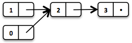

# Intro to Data Structures / Functional Data Structures in OO-Land

---

### Calibration (0)


Data structures?

---

### Calibration (1)


- Big-O and complexity?
- Interfaces vs. Implementation

---

### Calibration (2)

- Arrays?
- Linked Lists?
- Stacks and Queues?
- Hashing? Maps?
- Sets?

---

### Calibration (3)

- Immutability? Immutable data structures?
- Persistent data structures?
- Garbage collection?

---

### Preface

- Language agnostic, so I used `python`
- Trigger warning for folks with Mathematics / CS Theory background (why are you here anyway?)

---

## Primers

Data Structures, Complexity, Interfaces

---

### Data Structures

- Data lives in memory
- How we store that data in memory is important
- Computers are fast...but not that fast

---

### Big-O

$$f(x) = O(g(x))$$

if and only if

$$|f(x)| \leq M|g(x)|$$

for all $$x \geq x_0$$

---


---

### Complexity

$$O(1)$$

```python
x = 5
```

$$O(n)$$

```python
x = [1, 2, 3, 4, 5]
for i in x:
    print(i * 2)
```

$$O(n^2)$$

```python
x = [1, 2, 3, 4, 5]
for i in x:
    for j in x:
        print(i + j)
```

---

$$O(\log{n})$$

Binary search

$$O(n\log{n})$$

Most (practical) sorting algorithms

---

### Interfaces vs Implementations

- Interfaces: what a data structure does.
- Implementation: how a data structure does it

---

## Common Data Structures

---

### List Interface

- Support `add(item, i)`, `remove(i)`, `get(i)`, `set(item, i)`
- Could use an Array, but what happens when you (1) add items (2) run out of space in the Array?
- Array backed lists

```
[ ][ ][ ][ ][ ][ ][ ][ ][ ][ ]
[a][b][c][ ][ ][ ][ ][ ][ ][ ]
[a][b][c][d][ ][ ][ ][ ][ ][ ]
[e][a][b][c][d][ ][ ][ ][ ][ ]
```

---

#### Linked List

```python
class Node:
    def __init__(self, data, next):
        self.data = data
        self.next = next
```

---

```python
class LinkedList:
    def __init__(self):
        self.head = Node(None, None)
        self.size = 0

    def add(self, item, index):
        current = self.head
        for i in range(0, index):
            current = current.next
        node = Node(item, current.next)
        current.next = node
        self.size = self.size + 1
```

---

#### Doubly Linked List

```python
class Node:
    def __init__(self, data, prev, next):
        self.data = data
        self.prev = prev
        self.next = next
```

---

```python
class LinkedList:
    def __init__(self):
        self.head = Node(None, None, None)
        self.tail = Node(None, self.head, None)
        self.head = self.tail
        self.size = 0

    def add(self, item, index):
        current = self.head
        for i in range(0, index):
            current = current.next
        node = Node(item, current.prev, current)
        node.prev.next = node
        current.prev = node
        size += 1
```

---

### Stack and Queue Interfaces

- Stack: Last In First Out (LIFO)
    - Can be implemented using a Linked List
- Queues: First In First Out (FIFO)
    - Can be implemented using a Doubly Linked List

---

### Map Interface

- A dictionary! Supports `get(key)` and `set(key, value)`
- Sketch of an implementation of a hash map
- Hashing and keys

---

### Set Interface

- A dictionary (without values). Supports `contains(key)` and `add(key)`
- HashSet is a common implementation

---

## Fun Stuff

Functional Data Structures!

> You can have any data structure you want as long as it's imperative - Not Henry Ford

---

### Motivating 'Wat's

```java
public class Rectangle implements Comparable<Rectangle> {
    private int width, height;
    public Rectangle(int width, int height);

    public int getWidth();
    public int getHeight();
    public void setWidth(int width);
    public void setHeight(int height);

    public int hashCode();
    public boolean equals(Object o);
    public int compareTo(Rectangle r);
}
```

---

```java
Set<Rectangle> s = new HashSet<Rectangle>();
Rectangle r = new Rectangle(2, 3);
s.add(r);

r.setWidth(5);
s.size(); // 1
s.contains(r) // AHA false

// even more fun...
s.add(r); // s = [Rectangle(5, 3), Rectangle(5, 3)]
```

---

### Java's Solution

```java
Set<Rectangle> s = new HashSet<Rectangle>();
Rectangle r = new Rectangle(2, 3);
Set<Rectangle> sUnmodifiable = Collections.unmodifiableSet(r);
sUnmodifiable.add(new Rectangle(3, 4)); // throws
```

You could also always create new sets, do a deep-copy. Still icky.

---

### Functional Data Structures


---

### What's Good?

- Immutability (no assignments)
- Persistence

---

### How to Build a List

```java
final class Cons<T> implements List<T>{
    private final T head;
    private final List<T> tail;
    private final int length;

    public static List<T> of(int... items) {
        // factory method that supports e.g.
        // List<Integer> list1 = List.of(1, 2, 3);
    }
}
```


---

### How to Prepend a List

```java
@Override
default List<T> prepend(T element) {
    return new Cons<>(element, this);
}
```



---

